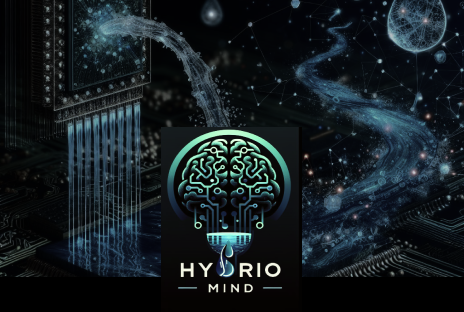

# HydrioMind  

**Aplicativo Inteligente para Monitoramento de Consumo de Água e Energia com Foco na Eficiência das IAs em Treinamento**  

---

## Problema  
Atualmente, o desperdício de água é um dos grandes desafios globais, e um fator menos evidente nesse problema é o uso ineficiente de Inteligências Artificiais (IAs) em treinamento. Durante os processos de desenvolvimento e aprendizado, muitas IAs consomem recursos desnecessariamente devido à falta de sistemas otimizados que regulem seu impacto no consumo de água.  

Empresas e desenvolvedores frequentemente não possuem ferramentas específicas para identificar e reduzir os desperdícios gerados por sistemas que utilizam grandes volumes de água para resfriamento, testes ou operações relacionadas. Isso resulta em um impacto ambiental significativo e custos adicionais.  

---

## Solução  
**HydrioMind** é um aplicativo inovador que:  
- Monitora o consumo de água e energia em tempo real durante o treinamento e operação de IAs.  
- Utiliza análises baseadas em IA para identificar e corrigir padrões de uso ineficazes.  
- Ajuda equipes e empresas a ajustar suas práticas para reduzir o consumo excessivo e desnecessário de água durante processos de treinamento e execução de Inteligências Artificiais.  

**HydrioMind** é a ferramenta ideal para alinhar eficiência operacional com sustentabilidade ambiental.  

---

## Benefícios  

### 🌊 **Redução do Desperdício de Água em Treinamento de IAs**  
- Identifica padrões ineficazes que geram desperdício de água.  
- Oferece insights para otimizar o uso de recursos durante o treinamento de modelos de IA.  

### 🤖 **Eficiência de IAs em Treinamento e Operação**  
- Garante que os recursos hídricos e energéticos sejam usados de forma sustentável.  
- Minimiza o impacto ambiental gerado por processos de alto consumo durante o aprendizado de máquinas.  

### 💰 **Economia de Recursos e Custos**  
- Reduz o desperdício desnecessário, gerando economia para empresas e desenvolvedores.  
- Contribui para uma gestão mais eficiente e consciente dos recursos.  

### 🌱 **Impacto Ambiental Positivo**  
- Promove práticas mais sustentáveis no desenvolvimento e uso de IAs.  
- Alinha-se às metas globais de preservação de recursos hídricos e energéticos.  

---

## Tecnologias Utilizadas  

- **[React Native](https://reactnative.dev/)**: Para criar um aplicativo mobile moderno e eficiente.  
- **[Expo](https://expo.dev/)**: Para acelerar o desenvolvimento e a distribuição da aplicação.  
- **[Firebase](https://firebase.google.com/)**: Para armazenar dados, gerenciar autenticação e realizar análises em tempo real.  

---

## Links IMPORTANTES 

- [Documentação](https://www.canva.com/design/DAGXOszTgWc/MJm-vgIZ6vALIFAmjAvEkg/edit?utm_content=DAGXOszTgWc&utm_campaign=designshare&utm_medium=link2&utm_source=sharebutton)
  
- [Figma](https://www.figma.com/design/pRDMvnWEvPSXTBzhiFSuee/Hydro-Mind?node-id=0-1&t=ZjremckOY2yL5crc-1)

-[Video]()

-----------------------------------------------------------------------------------------------------
# Como Executar o Projeto

1. **Clone o Repositório**:

```bash
git clone https://github.com/annxsbea/HydroMind.git
```
2.Instale as Dependências:
```
cd challenge-plusoft-2tdsa-2024-cgeniuns
npm install
```
3.Execute o Projeto:
```
npm start
```
4.Acesse o Aplicativo:

Escaneie o QR code gerado com o aplicativo Expo Go em seu dispositivo móvel, ou
Abra o simulador iOS ou Android, dependendo da sua preferência, ou
Acesse via web.

5.Para Fazer Login:

Utilize as seguintes credenciais:

-Usuário: BiaAnna@adm.com / Senha: 123456


ou Crie sua conta!

6.Contribuição

Contribuições são bem-vindas! Sinta-se à vontade para enviar pull requests com melhorias, correções de bugs ou novas funcionalidades.
